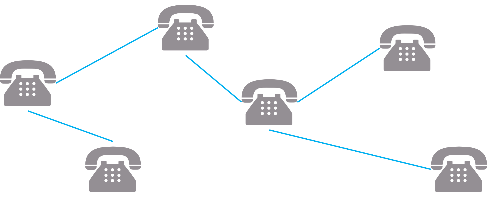

## 최소 신장 트리(MST, Minimum Spanning Tree)

### Spanning Tree란

- 그래프 내의 모든 정점을 포함하는 트리
- Spanning Tree = 신장 트리 = 스패닝 트리
- Spanning Tree는 그래프의 __최소 연결 부분 그래프__이다.
  - 최소 연결 = 간선의 수가 가장 적다.
  - n개의 정점을 가지는 그래프의 최소 간선의 수는 (n-1)개이고, (n-1)개의 간선으로 연결되어 있으면 필연적으로 트리 형태가 되어, 이것이 바로 Spanning Tree가 된다.
- 즉, 그래프에서 일부 간선을 선택해서 만든 트리

### Spanning Tree의 특징

- DFS, BFS를 이용하여 그래프에서 신장 트리를 찾을 수 있다.
  - 탐색 도중에 사용된 간선만 모으면 만들 수 있다.
- 하나의 그래프에 많은 신장 트리가 존재할 수 있다.
- 신장 트리는 트리의 특수한 형태이므로, __모든 정점들이 연결__ 되어 있어야 하고, __사이클을 포함해서는 안된다.__
- 따라서, Spanning Tree는 그래프에 있는 __n개의 정점을 정확히 (n-1)개의 간선으로 연결__ 한다.

### Spanning Tree의 사용 사례

- 통신 네트워크 구축
- 
  - 예를 들어, 회사 내의 모든 전화기를 가장 적은 수의 케이블을 사용하여 연결하고자 하는 경우
  - n개의 위치를 연결하는 통신 네트워크를 최소의 링크(간선)를 이용하여 구축하고자 하는 경우, 최소 링크의 개수는 (n-1)개가 되고, 따라서 Spanning Tree가 가능해 진다.

### MST란

- Spanning Tree 중에서 사용된 간선들의 __가중치의 합이 최소__ 인 트리
- MST = Minimum Spanning Tree = 최소 신장 트리
- 각 간선의 가중치가 동일하지 않을 때, 단순히 가장 적은 간선을 사용했다고 해서 최소 비용이 얻어지는 것은 아니다.

### MST의 특징

- 간선의 가중치의 합이 최소여야 한다.
- n개의 정점을 가지는 그래프에 대해서 반드시 n-1개의 간선만 사용해야 한다.
- 사이클이 포함되어서는 안된다.

### MST의 사용 사례

- 통신망, 도로망, 유통망에서 길이, 구축 비용, 전송 시간 등을 최소로 구축하려는 경우
  - 도로 건설
    - 도시를 모두 연결하면서 도로의 길이가 최소가 되도록 하는 문제
  - 전기 회로
    - 단자들을 모두 연결하면서 전선의 길이가 최소가 되도록 하는 문제
  - 통신
    - 전화선의 길이가 최소가 되도록 전화 케이블 망을 구성하는 문제
  - 배관
    - 파이프를 모두 연결하면서 파이프의 총 길이가 최소가 되도록 연결하는 문제

### MST의 구현 방법

- Kruskal MST
- Prim MST