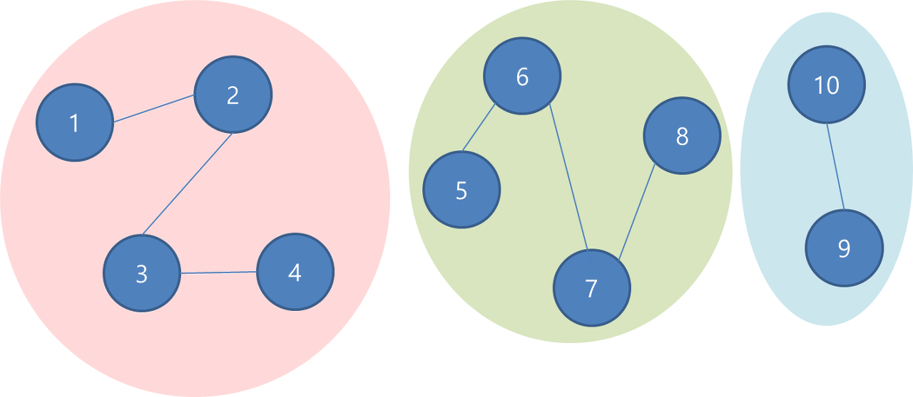
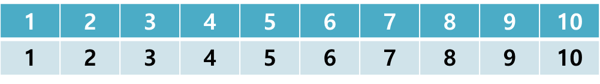
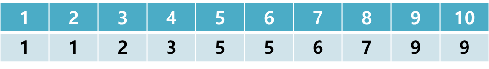

## Union Find 알고리즘

### Union Find 알고리즘이란?

- __Union Find__ 알고리즘은 다른 말로 __Disjoint-Set(서로소 집합)__ 알고리즘이라고 하기도 한다.
- 다수의 노드들 중에 __연결된 노드__ 를 찾고나, 노드들을 합칠 때 사용하는 알고리즘이다.

### Union Find의 구현

아래 그래프를 부모 노드를 기준으로 정리하면 아래 표와 같다.

- 부모 노드를 기준으로 정리

- Union-find 후

아래 블로그를 참고하여 작성하였습니다.

https://hongku.tistory.com/158