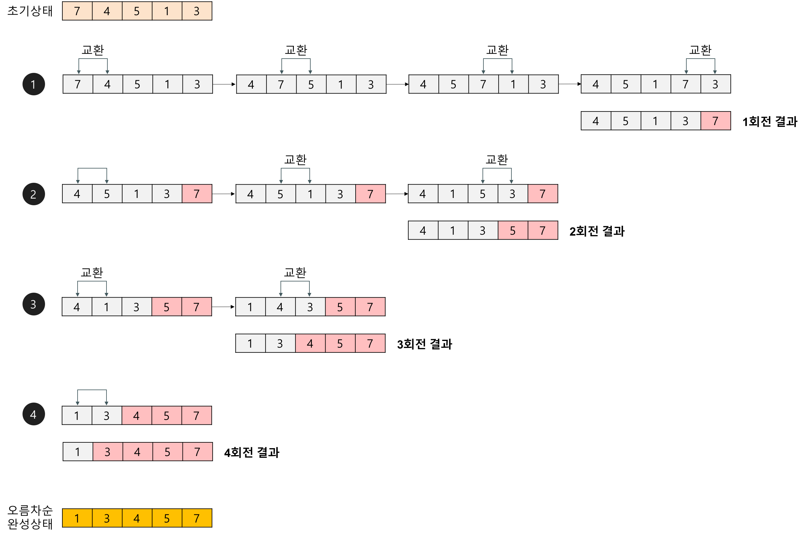

## 버블 정렬(Bubble sort) 알고리즘

- 서로 인접한 두 원소를 검사하여 정렬하는 알고리즘
  - 인접한 2개의 레코드를 비교하여 크기가 순서대로 되어 있지 않으면 서로 교환한다.
  - 선택 정렬과 기본 개념이 유사하다.
- 예제

- 장점
  - "순서대로 대소 비교 후 큰 것을 뒤로 보낸다"를 그대로 구현하면 되기 때문에, 코드가 보기에 직관적이고 구현이 쉽다.
  - Stable(in-place) 정렬이다
- 단점
  - 최악, 최선의 경우 모두 O(N^2)이기에 비효율적이다.