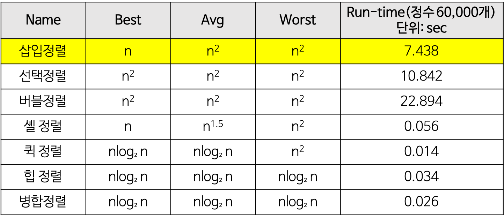

### 삽입 정렬(Insertion Sort)이란?

- 손 안의 카드를 정렬하는 방법과 유사하다.
- 새로운 카드를 기존의 정렬된 카드 사이 중 올바른 자리에 삽입한다.
- 자료 배열의 모든 요소를 __앞에서부터 차례로 이미 정렬된 배열 부분과 비교__ 하면서, 자신의 위치를 찾아 삽입함으로써 정렬이 완성된다.


### 삽입 정렬의 구체적 개념

- 두 번째 자료부터 시작하여, 그 앞 자료들과 비교하면서 삽입할 위치를 지정한 후, 앞의 자료들을 뒤로 옮기고 지정된 자리에 해당 자료를 삽입하여 정렬하는 알고리즘.


### 삽입 정렬의 예제


- c++

```c++
#include <iostream>
using namespace std;

int main() {
    int arr[] = {8, 5, 6, 2, 4};
    int i, j, key;
    for(i=1; i<5; i++){
        key = arr[i];
        for(j=i-1; j>=0 && arr[j]>key; j--){
            arr[j+1] = arr[j];
        }
        arr[j+1] = key;
        for(j=0; j<5; j++)
            cout << arr[j] << ' ';
        cout << '\n';
    }
    return 0;
}
```


- 장점
  - 안정된 정렬 방법
  - 레코드 수가 적을 경우에, 알고리즘 자체가 매우 간단하므로 다른 복잡한 정렬들보다 유리할 수 있다.
  - 레코드가 이미 정렬되어있는 경우에 매우 효율적이다.
- 단점
  - 비교적 많은 레코드들의 이동을 포함한다.
  - 레코드 수가 많고 레코드 크기가 클 경우에는 적합하지 않다.
- Time Complexity




아래 블로그를 참고하여 작성하였습니다.
https://github.com/WeareSoft/tech-interview