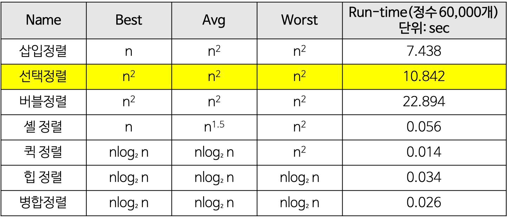

선택 정렬

- 제자리 정렬(in-place) 정렬 중에 하나
  - 입력 배열(정렬되지 않은 값들) 이외에 다른 추가 메모리를 요구하지 않는 정렬 방법.
- 순서별로 원소를 넣은 위치는 정해져있으며, 그 위치에 어떤 원소를 넣을지 선택하는 알고리즘.
  - 첫 번째 순서에는 첫 번째 위치에 가장 최솟값을 넣는다.
  - 두 번째 순서에는 두 번째 위치에 남은 값 중에서의 최솟값을 넣는다.
- 과정 설명
  - 주어진 배열 중에서 최솟값을 찾는다.
  - 그 값을 맨 앞에 위치한 값과 교체한다(swap)
  - 맨 처음 위치를 뺀 나머지 리스트를 동일한 방법으로 교체한다.
  - 하나의 원소만 남을 때까지 위의 과정을 반복한다.
- 예제

- 선택 정렬의 특징
  - 장점
    - 비교적 쉬운 코드로 구현 가능
    - 정렬이 진행됨에 따라서, 속토는 빨라짐.
    - 버블 정렬보다 값의 복사와 이동이 적어 비교적으로 빠름.
  - 단점
    - 데이터의 크기가 커질수록 효율이 떨어짐.
    - O(N^2)로 고정적이기에, 더 이상의 정렬 속도를 기대할 수 없음.
- Time Complexity Table
- 