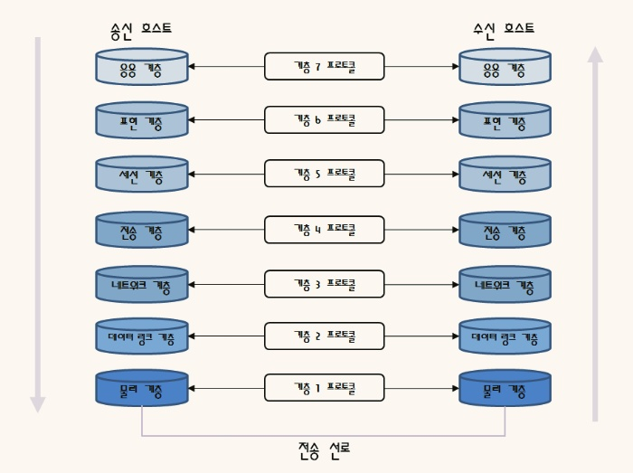

## OSI 7 계층

### OSI 7 Layer란

- Open Systems Interconnection Reference Model의 줄인말.
- 국제 표준화 기구(ISO)에서 개발한 모델로, 컴퓨터 네트워크 프로토콜 디자인과 통신을 계층으로 나누어 설명한 것이다.

- 동일 계층에 위치한 통신 양단은 같은 프로토콜을 사용하여 통신하기에, 동료 프로세스라고도 한다.
- 하나의 계층에서 상하로 이웃하는 모듈 사이에는 __인터페이스가 정의__ 되어있어, 접근 방법을 제한한다.
- 즉, 송신 호스트에서 데이터를 보낼 때에는, 같은 계층의 동료 프로세스에 __직접 전달__ 하는 것이 아니라, __하위 계층에 서비스를 요청__ 하는 방식으로 진행된다.
- 반면, 수신 호스트는 이와는 반대로 하위 계층에서 상위 계층으로 데이터가 전달 된다.

### 탄생 배경

- 기존 통신 업체들의 제품 간에 상호 호환이 되지 않고 업체 내의 장비들에만 호환이 가능했다. 여러 통신 업체 장비들간의 호환성이 필요하게 되어, OSI 모델이 탄생하였다.
- 즉, 네트워크 상에서 여러 대의 컴퓨터가 데이터를 주고 받기 위해서, 표준화된 네트워크 구조를 제시한 기본 모델을 뜻한다.

### 각 계층의 역할과 장비

- __물리 계층(Physical Layer)__
  - 통신케이블을 통해 데이터를 전송하는 계층.
  - 데이터를 전송하기만 할 뿐, 무슨 데이터인지는 신경 쓰지 않음.
  - 전송 단위: Bit
  - 장비: 케이블 종류(UTP 케이블, 동축 케이블), 허브
- __데이터 링크 계층(Data Link Layer)__
  - MAC address를 통해 통신을 하는 계층.
  - 송수신하는 정보가 안전하게 전달되도록 서비스를 제공하는 계층.
  - 오류 검출과 흐름 제어를 통해 안전하게 도달하도록 함.
  - 여기서 붙는 헤더를 Frame이라고 한다.
  - 전송 단위: Frame
  - 장비: 브릿지(프레임을 하드웨어 방식으로 처리, 포트들의 속도가 다름), 스위치(프레임을 하드웨어 방식으로 처리, 포트들의 속도가 같음)
  - 프로토콜: 이더넷
- __네트워크 계층(Network Layer)__
  - 시스템 간 연결성과 경로 선택을 제공하는 계층
  - 여기서 붙은 헤더를 Packet이라 한다.
  - IP address를 이용하여 라우팅 프로토콜이 연결된 네트워크를 통한 최적 경로를 선택.
  - 전송 단위: Packet
  - 장비: 라우터
  - 프로토콜: IP, ICMP, ARP
- __전송 계층(Transport Layer)__
  - end point 간 제어와 에러를 관리함.
  - 여기서 붙은 헤더를 __세그먼트__(TCP의 경우, UDP의 경우 __Datagram__)라고 한다.
  - 신뢰성 있는 전송을 보장하기 위해 오류 및 흐름제어, 복구 등을 수행.
  - Segment에 포트 정보가 포함된다.
  - 전송 단위: Segment/Datagram
  - 장비: TCP, UDP
  - 프로토콜: Gate, L4 Switch
- __세션 계층(Session Layer)__
  - 앞 4개 계층이 데이터 전송과 관련된 계층이라면, 아래 3개 계층은 어플리케이션과 관련 있는 서비스를 제공.
  - 어플리케이션 간 세션을 구축하고 관리하며 종료하는 역할.
  - 포트 연결이라고도 할 수 있음. 포트 번호를 기반으로 통신 세션을 구성함.
  - 전송 단위: Data
  - 프로토콜: SSH, NetBIOS, TLS
- __표현 계층(Presentation Layer)__
  - 데이터를 정해진 표현 형태로 변환함.
  - 확장자나 인코딩 등이 포함.
  - 예를 들면, 동영상 파일, 그림 파일, 문서 파일 등이 있음.
  - 프로토콜: JPEG, MPEG
- __응용 계층(Application Layer)__
  - 소프트웨어, 사용자의 인터페이스를 담당.
  - 유저와 가장 가까운 계층으로, 상대방이 보낸 데이터의 최종 목적지
  - 프로토콜: DNS, FTP, HTTP