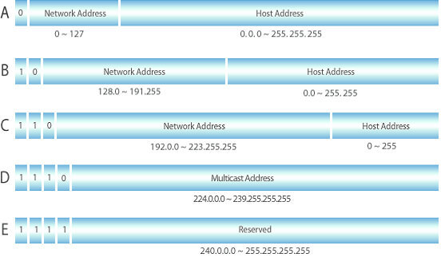
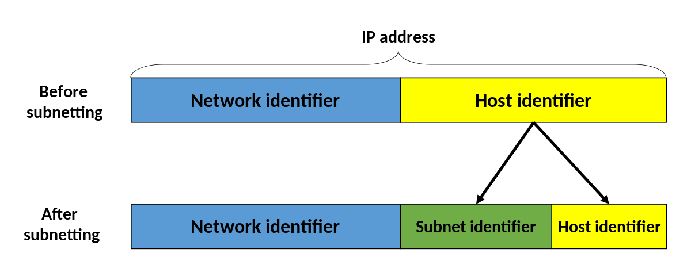
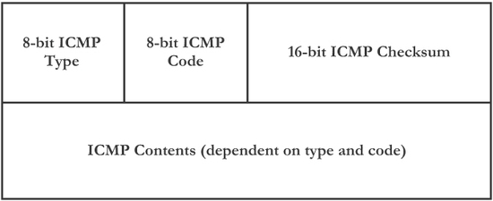

### IP(Internet Protocol)

- **주소화, 데이터그램 포맷, 패킷 핸들링** 등을 정의해놓은 인터넷 규약
- 인터넷 프로토콜은 현재 IPv4와 IPv6을 사용한다.
- IPv4: **32비트** 의 주소 체계를 가지고 있고, 이러한 주소체계는 **네트워크 ID**와 **호스트 ID**로 구분된다.
- IPv4: IP 주소의 부족 문제를 해결하기 위해서 주소 비트 수를 **128비트** 로 늘린 것으로 이것은 모든 디지털 단말기에 IP 주소를 부여하여 인터넷과연계하려고 하는 것이다. 우리는 최근 이러한 서비스를 IoT 서비스라고도 한다.


### 네트워크 계층(OSI 7)/인터넷 계층(TCP/IP)의 프로토콜 종류

- 라우팅 프로토콜
  - 경로 선택
  - RIP, OSPF, BGP 등
- IP 프로토콜
  - 주소화
  - 데이터그램 포맷
  - 패킷 핸들링 규약
- ICMP 프로토콜
  - 에러보고
  - 라우터 시그널링


### IP 헤더 구조

IP 헤더 구조를 보면, IP 프로토콜이 무슨 기능을 가지고 있는지 좀 더 명확하게 알 수 있따. IP Header는 **버전(Version) 정보**를 가지고 있다. 버전 정보는 IPv4 혹은 IPv6을 구분하는 역할을 수행하며, 즉, 버전 정보를 보고 라우터가 IP 헤더 구조를 파악하는 것이다.

또한 **Flag**와 **Fragment Offset**이라는 것이 있는데, 이것은 패킷을 전송할 때 패킷의 크기가 너무 크면 패킷은 분할되고 패킷이 분할될 경우 분할된 패킷을 수신자가 수신 이후에 다시 조립을 해야 하기 때문에 **패킷 분할과 관련된 정보**가 있는 것이다. 네트워크에는 **MTU(Maximum Transmission Unit)**라는 것이 있는데, MTU는 **한 번에 통과할 수 있는 패킷의 최대 크기**를 의미한다. 그래서 MTU 값보다 패킷의 크기가 크면 패킷은 분할되고 그 정보를 Flag와 Offset이 가지고 있게 된다. MTU 값을 확인하고 싶으면 이더넷(Ethernet) 정보를 조회하면 되고 리눅스에서 **ifconfig 명령**을 실행하면 된다.

**TTL(Time To Live)**은 IP 패킷이 통과할 수 있는 라우터의 수를 의미하며 라우터를 하나 통과할 때마다 1씩 감소하여 0이 되면 패킷은 자동으로 폐기된다. 이는 **인터넷에서 무한정으로 떠도는 패킷을 없애기 위함**이다.

**Protocol**은 IP Header 위의 **상위 프로토콜의 종류**를 의미하며, TCP 혹은 UDP인지를 의미한다.

**Header Checksum** 은 **헤더의 무결성을 검사**하기 위한 것이다.

```
*IP(Internet Protocol) Header 구조
- Version: IPv4 버전
- Header Length: Header 전체의 길이
- Type of Service: 서비스 유형
- Total Length: IP Datagram의 Byte 수
- Identification: Host에서 보낸 Datagram 식별
- Flags & Offset: IP Datagram 단편화 정보
- Time to Live: Datagram이 통과할 수 있는 라우터 수
- Protocol: ICMP, TCP, UDP
- Header Checksum: IP Header Checksum 계산
```


### IP 주소의 구조

IP 주소는 클래스(Class)로 구분되며, **클래스**는 **IP 주소를 분류하는 기준**으로 사용된다. IP 클래스의 구조는 네트워크 ID와 호스트 ID로 분류할 수 있는데 **네트워크 ID**는 **네트워크에 부여될 수 있는 것**이고 **호스트 ID**는 **하나의 네트워크에 부여될 수 있는 호스트 IP 주소의 자릿수**이다. 그러므로 최대 32비트에 호스트 ID의 자리가 크면 하나의 네트워크에서 많은 수의 컴퓨터에 IP주소를 부여해서 사용할 수 있는 것이다.




#### 클래스의 구조

| 클래스  | 메시지                                                       |
| ------- | ------------------------------------------------------------ |
| Class A | - 첫 바이트 7Bit가 네트워크 식별자 <br>- 한 네트워크에 **가장 많은 호스트** 를 가짐 |
| Class B | - 14Bit의 네트워크 식별자<br>- 한 네트워크에 약 2^16대의 호스트 수용 |
| Class C | - 세 번째 바이트까지 네트워크 식별자<br>- 한 네트워크에 254대까지 수용 |
| Class D | 멀티캐스트 주소로 사용                                       |


### 서브넷팅(Subnetting)

- 주어진 네트워크 주소는 작게 나뉘어 여러 개의 **서브넷(논리적)**으로 구성된다.
- 네트워크 식별자 부분을 구분하기 위한 mask를 **서브넷 마스크(Subnet Mask)**라고 한다.




### 수퍼넷팅(Supernetting)

ISP(Internet Service Provider) 사업자가 많은 네트워크 망을 효율적으로 관리하기 위해서 네트워크를 묶어 관리하는 방법이다.


### ICMP

- TCP/IP에서 **오류 제어 프로토콜**이다.
- 호스트 및 라우터는 다른 호스트나 라우터가 현재 도달 가능한지의 여부를 결정한다.
- 라우터는 특정 목적지 네트워크로 후속 IP 데이터그램을 보냈는데, 사용할 수 있는 더 좋은 경로가 있을 때 근원지 호스트에게 통지한다.
- 호스트나 라우터는 그들이 처리하기에 너무 빠른 IP 데이터그램이 도착하면 다른 시스템에게 통보한다.


#### ICMP의 주요 기능

- 오류 보고 메시지: IP 패킷 처리 도중 발견된 문제를 보고
- 질의 메시지: 다른 호스트로부터 특정 정보를 획득하기 위해 사용


####  메시지 구조

- Type: ICMP 메시지 유형 표시
- Code: Type과 같이 사용되며 세부적인 유형을 표현
- Checksum: IP Datagram Checksum




#### ICMP 메시지

| Type     | Message                     | 설명                                                         |
| -------- | --------------------------- | ------------------------------------------------------------ |
| 3        | Destination Unreachable     | 라우터가 목적지를 찾지 못하는 경우 보내는 메시지             |
| 4        | Source quench               | 패킷을 너무 빨리 보내 네트워크에 무리를 주는 호스트를 제지할 때 사용 |
| 5        | Redirection                 | 패킷 라우팅 경로를 수정, Smurf 공격에서 사용                 |
| 8 or 0   | Echo request or reply       | Host의 존재를 확인                                           |
| 11       | Time exceeded               | 패킷을 보냈으나 시간이 경과하여 패킷이 삭제되었을 때 보내는 메시지 |
| 12       | Parameter Problem           | IP Header field에 잘못된 정보가 있다는 것을 알림             |
| 13 or 14 | Timestamp request and reply | Echo와 비슷하나 시간에 대한 정보 추가                        |


### 데이터 전송 방식과 멀티캐스트

데이터 전송 방식은 송신자와 수신자 간에 어떻게 데이터를 보낼 것인지를 의미한다. 즉, 1대 1로 데이터를 전송하는 것은 **유니캐스트(Unicast)**이고 1대 N으로 모두에게 전송하는 것은 **브로드캐스트(Broadcast)**이다. **멀티캐스트(Multicast)**는 1:N 전송 또는 M:N 전송에서 특정 사용자에게만 데이터를 전송하는 것이다. **애니케스트(Anycast)**는 IPv6에 새롭게 등장한 것으로 그룹에 등록된 노드 중에서 최단 경로 노드 한 개에만 전송하는 기술이며, IPv6부터는 브로드캐스트가 없어졌다.


#### 멀티캐스트와 IGMP(Internet Group Management Protocol)

멀티캐스트는 그룹에 등록된 사용자에게만 데이터는 전송하는 것이다. **그룹에 등록된 사용자를 관리하는 프로토콜**이 바로 **IGMP**이다.


#### IGMP 메시지 구조

- 8 byte로 구성된다.
- Version: IGMP 프로토콜의 버전 표시, 현재 IGMP Version 2이다.
- Type: 메시지 유형, 1=보고, 2=질의 메시지
- Group ID: 보고 메시지의 경우 호스트에서 신규 가입하고자 하는 멀티캐스트 서비스의 group id, 계속 받아보기를 원하는 멀티캐스트 서비스의 group id 질의메시지의 경우 0


### ARP(Address Resolution Protocol)

ARP 프로토콜은 IP 주소를 물리적 하드웨어 주소인 MAC 주소로 변경하는 프로토콜이다. ARP 프로토콜은 ARP 리퀘스트를 보내고 인접에 있는 컴퓨터가 ARP Reply로 응답한 것을 통해서 **ARP Cache Table**을 유지한 후 인접 컴퓨터의 IP 주소와 MAC 주소를 가지고 있게 되는 것이다. 

- 인터넷 주소(IP)를 물리적 하드웨어 주소(MAC)로 매핑한다.
- IP 주소와 이에 해당하는 물리적 네트워크 주소 정보는 각 IP 호스트의 **ARP 캐시**라 불리는 메모리에 테이블 형태로 저장된 후 다음 패킷 전송 시에 다시 사용된다.
- ARP Cache Table은 MAC 주소와 IP 주소를 보유하고 있는 매핑 테이블이다.


### RARP(Reverse Address Resolution Protocol)

- 물리적인 주소 MAC을 기반으로 논리적인 주소 IP를 알아오는 프로토콜이다.
- 하나의 호스트를 RARP 서버로 지정한다.
- 디스크 없는 워크스테이션은 RARP Request 패킷을 전송한다.
- RARP 서버는 디스크가 없는 워크스테이션들의 물리적 하드웨어 주소(MAC)를 인터넷 주소로 매핑한다.
- RARP 서버는 인터넷 주소를 포함한 RARP Response 패킷으로 응답한다.
- RARP 요청 메시지는 브로트케스트로 전송하고, 유니캐스트로 전송(요청 메시지에 송신자의 주소가 포함)한다.

RARP는 Diskless Host에서 사용하는 것으로 이것은 운영체제도 없는 일종의 더미 터미널이다. 더미 터미널에서 자신의 물리적 주소인 MAC 주소를 서버에 전송하고 IP 주소를 수신 받아서 기동하는 것이다. 이것은 일반적인 데스크톱 PC에서는 필요하지 않고, 과거 은행에서 더미 터미널을 사용했을 경우 사용했던 방법이다.