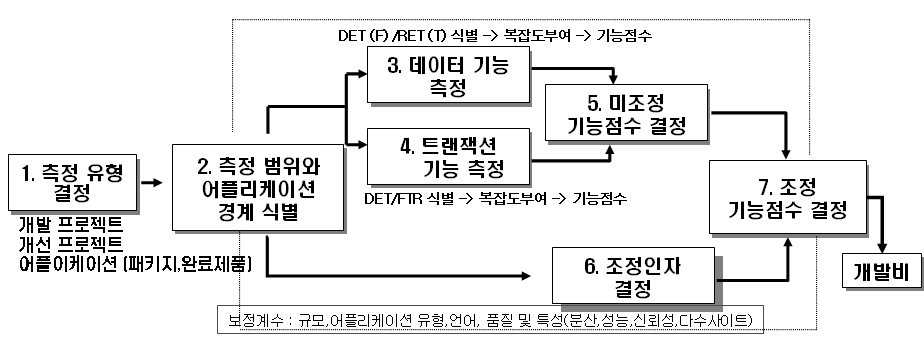

###  기능 점수(Function Point) 모델

소프트웨어의 **각 기능에 대하여 가중치를 부여** 하여 **요인별 가중치를 합산** 해서 **소프트웨어의 규모나 복잡도, 난이도** 를 산출하는 모형이다. 이는 **소프트웨어의 생산성 측정** 을 위해 개발되었으며, **자료의 입력과 출력, 알고리즘을 이용한 정보의 가공과 저장** 을 중시한다. 최근 **유용성** 과 **간편성** 때문에 관심이 집중되고 있으며, **라인 수에 기반을 두지 않는다는 것이 장점**이다.

### FP 방식의 특징

| 구분      | FP                                         | LOC                                        |
| --------- | ------------------------------------------ | ------------------------------------------ |
| 특징      | 기능 중심의 산정 방법 **사용자** 중심 | 크기 중심의 산정 방법 **개발자** 중심 |
| 규모 산정 | **초기 사업규모 예측 가능**                | **개발 50% 이상 지나야 예측 가능**         |
| 장점      | 기능 고려, LOC 단점 보완                   | 사용이 쉬움                                |
| 단점      | 복잡도 산정에 **주관이 개입 가능**         | 단순하고, **코드의 재사용을 무시**         |

### FP의 구성요소

| 구성요소                                    | 내용                                                         |
| ------------------------------------------- | ------------------------------------------------------------ |
| 내부논리파일(ILF, Internal Logic Files)     |                                                              |
| 외부연계파일(EIF, External Interface Files) | 타시스템의 데이터를 가져와서 DB에 저장하고 이를 표출하여 보여주는 경우. 단, API를 이용하여 보여주기만하고 API데이터를 저장하지 않으면 이는 해당되지 않음.(이는 EQ 또는 EO에 해당) |
| 외부입력(EI, External Input)                | 어플리케이션 외부로부터 데이터 또는 제어정보를 받아들여, 내부 논리파일(ILF)의 유지(추가, 수정 삭제 등)나 어플리케이션의 상테에 변경을 요구하는 단위 프로세스 |
| 외부출력(EO, External Output)               | 평균, 합계 등 기타 수식에 의해 계산된 데이터를 사용한 파생데이터인 경우 |
| 외부조회(EQ, Exernal inQueries)             | Select * from 등으로 어플리케이션 내부 DB 데이터를 계산 없이 그대로 표출하는 경우 |

### FP 프로세스

| 종류                 | 내용                                                         |
| -------------------- | ------------------------------------------------------------ |
| 측정(계산) 유형 결정 | 개발 프로젝트 개선 프로젝트 어플리케이션           |
| 범위 및 경계 식별    | SW 사업 범위와 어플리케이션의 ILF, EIF를 구분하여 경계 식별  |
| 데이터 기능 계산     | ILF와 EIF를 식별하고, DET/RET을 기반으로 복잡도를 계산하고, 미조정 데이터 기능 점수를 계산 |
| 트랜젝션 기능 계산   | 외부 입력(EI), 외부 출력(EO), 외부 조회(EQ) 식별함. DET/FTR를 기반으로 복잡도를 계산하고 트랜젝션 기능 점수를 계산 |
| 미조정 FP 계산       | 데이터 기능점수+트랜젝션 기능 점수                           |
| 조정인자 결정        | 보정계수(규모, 어플리케이션 유형, 언어, 품질 등의 특성) * 0.01 + 0.65 |
| 조정 기능점수 결정   | 미조정 FP 점수 * 보정계수                                    |

